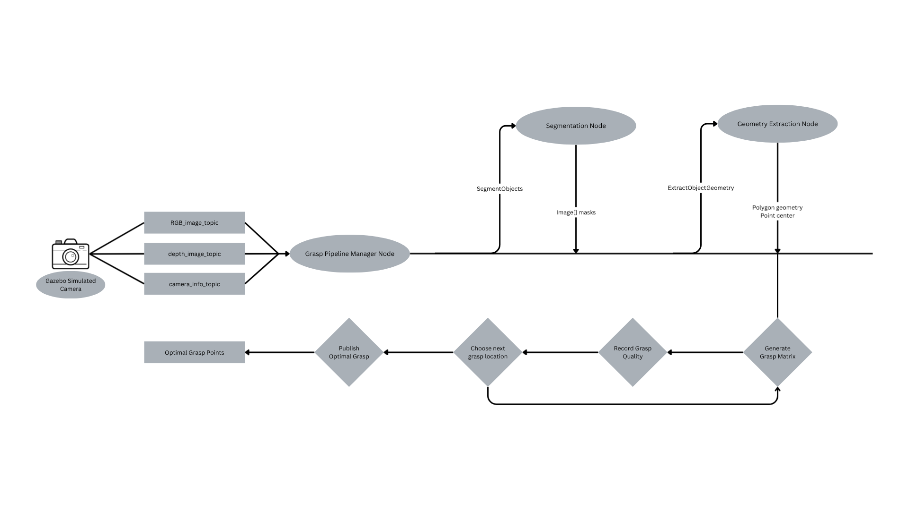

# Grasping using top surfaces

## Project Setup

Place this repository inside your ROS2 workspace src folder like a package. The folders within the TopSurfaceGrasping folder are the actual packages used to develop the ROS2 nodes we need.

## Use Cases

1. **Segment object in point cloud**
    - Given detection boxes and the RGB image, generate segmentation masks for each object and extract their corresponding segmented point clouds.
    - *Pipeline step:* The node calls the `segment_objects` service to obtain masks for each detected object.

1. **Shape from point cloud**
    - For each segmented point cloud (using RGB and Depth data), extract the top surface shape and compute the object's center of mass projected onto the top surface.
    - *Pipeline step:* The node calls the `extract_object_geometry` service for each mask and point cloud, returning a polygon (top surface) and center.

1. **Grasp generation**
    - Given a 2D shape and parallel gripper maximum grip size, sample possible grasp positions and generate a grasp matrix for each candidate.
    - *Pipeline step:* The node generates possible contact pairs on the polygon and computes grasp matrices.

1. **Grasp Quality**
    - For each pair of contact points, compute grasp quality metrics: Minimum Singular Value, Isotropy, and Ellipsoid volume.
    - *Pipeline step:* The node evaluates each grasp candidate using these metrics to select the best grasp.

1. **Grasp Search**
    - Use optimization (e.g., hill climbing) to iteratively improve grasp position, maximizing the quality metrics.
    - *Pipeline step:* The node currently selects the best grasp from sampled candidates; further optimization could be added.
